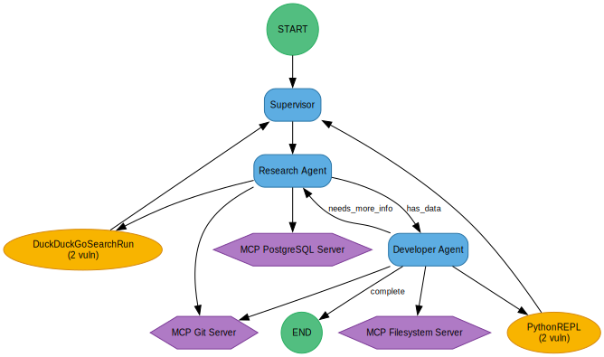

# AgentSec

**Static Security Analysis for AI Agent Workflows**

AgentSec is a security scanner that analyzes AI agent workflows built with popular frameworks like LangGraph, CrewAI, OpenAI Agents, Autogen, and n8n. It detects security vulnerabilities, maps them to OWASP/CWE standards, and generates detailed HTML reports with interactive visualizations.

## 🚀 Installation

### Prerequisites
- Python 3.8 or higher
- Poetry (recommended) or pip

### Install with Poetry (Recommended)

```bash
# Clone the repository
git clone https://github.com/yohanguez/AgentSec.git
cd AgentSec

# Install dependencies
poetry install

# Activate the virtual environment
poetry shell
```

### Install with pip

```bash
# Clone the repository
git clone https://github.com/yohanguez/AgentSec.git
cd AgentSec

# Install dependencies
pip install -e .
```

## 📖 Quick Start

### Scan a workflow

```bash
# Scan a LangGraph workflow
agentsec scan langgraph --input-dir ./examples

# Scan a CrewAI workflow
agentsec scan crewai --input-dir ./my-crewai-project

# Scan with all options
agentsec scan langgraph \
  --input-dir ./my-project \
  --output-file my-report.html \
  --export-graph-json
```

### Supported Frameworks

- **LangGraph** - Detect StateGraph workflows and tool usage
- **CrewAI** - Analyze agents, tasks, and crew configurations
- **OpenAI Agents** - Scan Agent SDK implementations
- **Autogen** - Find ConversableAgent patterns
- **n8n** - Parse workflow JSON files

## 📊 Example Report

AgentSec generates comprehensive HTML security reports. Here's an example from a multi-agent workflow analysis:

### 📈 Report Statistics

<table>
<tr>
<td align="center" width="33%">
<h3>⚠️ 4</h3>
<b>Vulnerabilities</b>
</td>
<td align="center" width="33%">
<h3>🤖 3</h3>
<b>Agents</b>
</td>
<td align="center" width="33%">
<h3>🔧 2</h3>
<b>Tools</b>
</td>
</tr>
</table>

### 🎨 Workflow Visualization

The report includes an interactive graph showing your complete agent workflow:



**Visual Elements:**
- 🔵 **Blue Rounded Boxes** - AI Agents (Supervisor, Research Agent, Developer Agent)
- 🟡 **Yellow Circles** - Tools (DuckDuckGo Search, Python REPL)
- 🟣 **Purple Hexagons** - MCP Servers (Filesystem, Git, PostgreSQL)
- 🟢 **Green Circles** - Start/End nodes
- **Arrows** - Data flow and agent handoffs
- **(X vuln)** - Vulnerability count on each component

### 🔍 What's Included in Reports

#### 1. **Workflow Graph**
Visual representation of all agents, tools, and their connections

#### 2. **Agent Details**
```
🤖 Research Agent (gpt-4-turbo)
├─ System Prompt: "You are a Research Agent..."
├─ Tools: Web Search, Database Query, Git Access
└─ Guardrails: ❌ Not Configured
```

#### 3. **Tool Analysis**
```
🔧 DuckDuckGoSearchRun (WEB_SEARCH)
└─ ⚠️  SSRF Vulnerability (2 vulns)
    ├─ OWASP: LLM07
    ├─ CWE: CWE-918
    └─ Remediation: Validate URLs, implement allow-lists
```

#### 4. **MCP Server Security**
```
🔌 MCP PostgreSQL Server (DATABASE)
└─ ⚠️  SQL Injection Risk (1 vuln)
    ├─ OWASP: A03:2021
    ├─ CWE: CWE-89
    └─ Remediation: Use parameterized queries
```

#### 5. **Vulnerability Summary**
- Detailed descriptions of each vulnerability
- OWASP Top 10 and CWE mappings
- Step-by-step remediation guidance
- Risk severity ratings

### 📋 Report Export Options

✅ **HTML Report** - Beautiful, interactive web page with graphs
✅ **JSON Export** - Machine-readable format for CI/CD integration
✅ **SVG Graphs** - Standalone visualizations

## 🔍 What AgentSec Detects

### Vulnerability Categories

- **SSRF (Server-Side Request Forgery)** - Web search tools, HTTP requests
- **Remote Code Execution** - Python REPL, code interpreters
- **Path Traversal** - File system access, document loaders
- **SQL Injection** - Database query tools
- **Prompt Injection** - Unvalidated LLM inputs
- **Data Leakage** - Sensitive information exposure

### Security Frameworks

All vulnerabilities are mapped to:
- **OWASP Top 10 for LLMs**
- **CWE (Common Weakness Enumeration)**
- **MITRE ATT&CK** (where applicable)

## 📁 Project Structure

```
AgentSec/
├── agentsec/
│   ├── analyzers/      # Framework-specific analyzers
│   ├── models/         # Data models (Graph, Node, Edge)
│   ├── mappers/        # Vulnerability mapping
│   ├── report/         # HTML report generation
│   ├── utils/          # AST parsing and file utilities
│   ├── cli/            # Command-line interface
│   └── data/           # Vulnerability database
├── examples/           # Example vulnerable workflows
├── tests/              # Test suite
└── README.md
```

## 🧪 Running Tests

```bash
# Run all tests
poetry run pytest

# Run with coverage
poetry run pytest --cov=agentsec

# Run specific test file
poetry run pytest tests/test_models.py
```

## 🛠️ Development

### Run Example Demos

```bash
# Test the core functionality
python test_tool.py

# Generate a multi-agent demo report
python test_multi_agent_demo.py

# See vulnerability detection in action
python vulnerability_detection_demo.py
```

## 📝 Example Usage

### Analyze a LangGraph Workflow

```python
from agentsec.analyzers import LangGraphAnalyzer
from agentsec.mappers import VulnerabilityMapper
from agentsec.report import ReportGenerator

# Analyze the code
analyzer = LangGraphAnalyzer(input_dir="./my-project")
graph = analyzer.analyze()

# Map vulnerabilities
mapper = VulnerabilityMapper()
graph = mapper.map_vulnerabilities(graph)

# Generate report
generator = ReportGenerator()
generator.generate_html(graph, "security-report.html")
```

## 🔒 Security Notes

AgentSec performs **static analysis only** - no code execution required. It:
- Parses Python AST (Abstract Syntax Tree)
- Identifies framework patterns
- Maps tools to vulnerability categories
- Generates actionable security reports

## 📄 License

This project is available for use as-is. See repository for details.

## 🤝 Contributing

Contributions are welcome! Please feel free to submit issues or pull requests.

## 📧 Contact

For questions or feedback, please open an issue on GitHub.

---

Built with ❤️ for securing AI agent workflows
