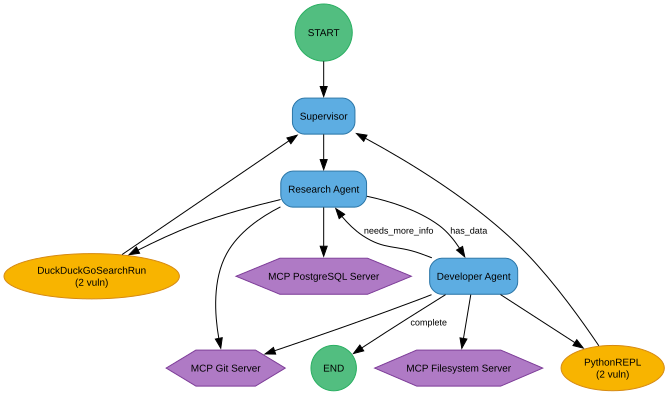

# AgentSec

[](https://github.com/yohanguez/AgentSec/actions/workflows/ci.yml)
[](https://codecov.io/gh/yohanguez/AgentSec)
[](LICENSE)
[](https://www.python.org/downloads/)
[](https://github.com/psf/black)

**Auditing AI Agents — Because Your Autonomous AI Probably Shouldn't Have Root**

AgentSec audits AI agent workflows for **excessive agency** and **abusable
attack paths**. It maps every agent's capabilities, grades how over-powered each
one is, and traces how untrusted input can reach dangerous capabilities *across
agent handoffs* — the analysis flat, per-file scanners can't do because they
don't model the workflow graph.

Supports LangGraph, CrewAI, OpenAI Agents, Autogen, and n8n.

## What makes it different

Most tools either red-team a live model (garak, PyRIT) or inventory what's
running (discovery scanners). AgentSec analyses the **workflow topology**
statically and answers three questions:

1. **What can each agent do?** — a per-agent privilege report card (grade A–F),
   built from a capability database *and* AST inspection of custom tools
   (`subprocess` → `shell_exec`, `cursor.execute` → `db_read`, …). Not just
   name-matching.
2. **Which agents are over-privileged?** — excessive-agency detection, plus the
   **Lethal Trifecta**: any agent with private-data access + untrusted-content
   exposure + external communication.
3. **Can untrusted input reach a dangerous sink?** — cross-agent taint /
   reachability, with honest confidence labels (HIGH within one agent, MEDIUM
   across a handoff). Attack paths are highlighted in red on the workflow graph.

## 🚀 Installation

```bash
git clone https://github.com/yohanguez/AgentSec.git
cd AgentSec

# Core (static audit + HTML/JSON reports)
pip install -e .

# With the runtime monitor and web dashboard
pip install -e ".[all]"      # or: ".[monitor]" / ".[server]"
```

## 📖 Quick Start

```bash
# Audit a workflow → interactive HTML report
agentsec scan langgraph -i demo/autoops -o report.html

# Machine-readable output for CI/CD
agentsec scan langgraph -i ./my-project --export-graph-json -o audit.json

# Launch the local dashboard (unified view of all runs)
agentsec serve                      # http://localhost:8000

# Observe live AI/LLM network traffic (needs sudo on macOS/Linux)
sudo agentsec monitor --duration 30
```

Try the bundled demo — an intentionally insecure incident-response crew that
exhibits every finding type (see [`demo/`](demo/README.md)):

```bash
agentsec scan langgraph -i demo/autoops -o report.html
```

### Commands

| Command | Purpose |
|---------|---------|
| `agentsec scan <framework> -i <dir>` | Static privilege/agency audit → HTML or JSON |
| `agentsec serve` | Local web dashboard (SQLite-backed run history) |
| `agentsec monitor` | Runtime AI-connection observation (psutil) |

### Supported Frameworks

- **LangGraph** — `create_react_agent` / `StateGraph`, per-agent tool attribution
- **CrewAI** — agents, tasks, and per-agent `tools=[...]`
- **OpenAI Agents** — Agent SDK implementations
- **Autogen** — ConversableAgent patterns
- **n8n** — workflow JSON files

## 📊 Example Report

AgentSec generates comprehensive HTML security reports. Here's an example from a multi-agent workflow analysis:

---

### 📄 [**➡️ CLICK HERE TO VIEW FULL REPORT EXAMPLE**](https://github.com/yohanguez/AgentSec/blob/main/example-report.html) ⬅️

*Download and open the HTML file to see the complete interactive report*

---

### 📈 Report Statistics

<table>
<tr>
<td align="center" width="33%">
<h3>⚠️ 4</h3>
<b>Vulnerabilities</b>
</td>
<td align="center" width="33%">
<h3>🤖 3</h3>
<b>Agents</b>
</td>
<td align="center" width="33%">
<h3>🔧 2</h3>
<b>Tools</b>
</td>
</tr>
</table>

### 🎨 Workflow Visualization

The report includes an interactive graph showing your complete agent workflow:



**Visual Elements:**
- 🔵 **Blue Rounded Boxes** - AI Agents (Supervisor, Research Agent, Developer Agent)
- 🟡 **Yellow Circles** - Tools (DuckDuckGo Search, Python REPL)
- 🟣 **Purple Hexagons** - MCP Servers (Filesystem, Git, PostgreSQL)
- 🟢 **Green Circles** - Start/End nodes
- **Arrows** - Data flow and agent handoffs
- **(X vuln)** - Vulnerability count on each component

### 🔍 What's Included in the Report

The full report includes:

#### 1. **📊 Workflow Visualization**
Interactive graph showing all agents, tools, MCP servers, and their connections

#### 2. **🤖 Agent Details**
Complete information about each agent:
- **Supervisor** (gpt-4) - Coordinates multiple specialized agents
- **Research Agent** (gpt-4-turbo) - Gathers information from web and databases
- **Developer Agent** (gpt-4-turbo) - Writes code and manages files
- Full system prompts and configurations

#### 3. **🔧 Tool Vulnerability Analysis**

**DuckDuckGoSearchRun** (2 vulnerabilities)
- ⚠️ **Server-Side Request Forgery (SSRF)**
  - OWASP: LLM09 - Improper Output Handling
  - CWE: CWE-918
  - Remediation: Validate URLs, implement domain allowlists, disable redirects

- ⚠️ **Information Disclosure**
  - OWASP: LLM06 - Sensitive Information Disclosure
  - CWE: CWE-200
  - Remediation: Filter search results, redact sensitive patterns

**PythonREPL** (2 vulnerabilities)
- ⚠️ **Remote Code Execution (RCE)**
  - OWASP: LLM07 - Insecure Plugin Design
  - CWE: CWE-94
  - Remediation: Use sandboxes, implement resource limits, validate inputs

- ⚠️ **Sandbox Escape**
  - CWE: CWE-693
  - Remediation: Regular updates, minimize attack surface, monitor behavior

#### 4. **🔌 MCP Server Analysis**
Security assessment of Model Context Protocol servers:
- MCP Filesystem Server
- MCP Git Server
- MCP PostgreSQL Server

#### 5. **🛡️ Detailed Remediation**
Step-by-step guidance for each vulnerability with actionable security controls

### 📋 Report Export Options

✅ **HTML Report** - Beautiful, interactive web page with graphs
✅ **JSON Export** - Machine-readable format for CI/CD integration
✅ **SVG Graphs** - Standalone visualizations

## 🔍 What AgentSec Detects

### Findings

- **Lethal Trifecta** *(critical)* — an agent with private-data access +
  untrusted-content exposure + external communication.
- **Excessive Agency** *(high/medium)* — agents that hold root-equivalent
  capability (code/shell execution) or aggregate too many dangerous capabilities.
- **Dangerous Reachable Paths** *(critical/high)* — untrusted input that can
  reach a dangerous sink (code exec, shell, DB/file write, exfil), traced across
  agent handoffs with HIGH/MEDIUM confidence labels.

### Capabilities tracked

`code_exec`, `shell_exec`, `fs_read`, `fs_write`, `db_read`, `db_write`,
`network_read`, `network_write`, `email_send`, `secrets_access` — resolved by
name, by category, and (for custom tools) by **AST signature inspection**.

### Security Frameworks

Findings are mapped to **OWASP Top 10 for LLMs** (notably LLM01 Prompt Injection
and LLM08 Excessive Agency) and **CWE**.

## 📁 Project Structure

```
AgentSec/
├── agentsec/
│   ├── analyzers/      # Framework-specific analyzers → workflow graph
│   ├── models/         # Data models (Graph, Node, Capability, Finding)
│   ├── audit/          # Flagship: capability tagging, AST signatures,
│   │                   #   reachability/taint, privilege scoring, detectors
│   ├── report/         # HTML report + graph visualizer (red attack paths)
│   ├── server/         # FastAPI dashboard + SQLite run store
│   ├── monitor/        # Runtime AI-connection monitor (psutil)
│   ├── mappers/        # Legacy vulnerability mapping
│   ├── utils/          # AST parsing and file utilities
│   ├── cli/            # Command-line interface (scan / serve / monitor)
│   └── data/           # Capability + vulnerability databases
├── demo/autoops/       # Intentionally insecure demo workflow
├── examples/           # Example workflows
├── tests/              # Test suite
└── README.md
```

## 🧪 Running Tests

```bash
# Run all tests
make test

# Or with poetry
poetry run pytest

# Run with coverage report
pytest --cov=agentsec --cov-report=html

# Run specific test file
pytest tests/test_models.py

# Run tests matching pattern
pytest -k "test_capability"
```

## 🛠️ Development

### Quick Start for Contributors

```bash
# 1. Clone and install
git clone https://github.com/yohanguez/AgentSec.git
cd AgentSec
make install

# 2. Install pre-commit hooks
make hooks

# 3. Run tests
make test

# 4. Format and lint code
make format
make lint

# 5. Run demo
make demo
```

### Development Workflow

AgentSec uses a professional development setup:

- **Code Formatting**: black (100 chars)
- **Linting**: ruff
- **Type Checking**: mypy
- **Testing**: pytest with 80% coverage requirement
- **Pre-commit Hooks**: Automatically format and check code before commit
- **CI/CD**: GitHub Actions with multi-OS, multi-Python testing

See [CONTRIBUTING.md](CONTRIBUTING.md) for detailed guidelines.

### Available Make Targets

```bash
make install    # Install all dependencies
make test       # Run test suite with coverage
make lint       # Check code quality
make format     # Auto-format code
make build      # Full pipeline (lint + test + wheel)
make hooks      # Install git pre-commit hooks
make clean      # Remove build artifacts
make demo       # Run demo analysis
make help       # Show all targets
```

### Run Example Demos

```bash
# Test the core functionality
python test_tool.py

# Generate a multi-agent demo report
python test_multi_agent_demo.py

# See vulnerability detection in action
python vulnerability_detection_demo.py
```

## 📝 Example Usage

### Analyze a LangGraph Workflow

```python
from pathlib import Path
from agentsec.analyzers import LangGraphAnalyzer
from agentsec.audit import Auditor
from agentsec.report import ReportGenerator

input_dir = Path("./my-project")

# 1. Build the workflow graph (agents, tools, MCP servers, edges)
graph = LangGraphAnalyzer(input_dir).analyze()

# 2. Audit: tag capabilities, score privilege, run detectors
graph = Auditor(input_dir).audit(graph)

for f in graph.findings:
    print(f.severity.value, f.title)

# 3. Report
ReportGenerator().generate_html(graph, Path("audit-report.html"))
```

## 🔒 Security Notes

AgentSec performs **static analysis only** - no code execution required. It:
- Parses Python AST (Abstract Syntax Tree)
- Identifies framework patterns
- Maps tools to vulnerability categories
- Generates actionable security reports

## 📄 License

Licensed under the Apache License, Version 2.0. See [LICENSE](LICENSE) for details.

Copyright 2026 Imperva, Inc.

## 🤝 Contributing

Contributions are welcome! We follow professional open source standards:

1. **Read Guidelines**: See [CONTRIBUTING.md](CONTRIBUTING.md) for setup and workflow
2. **Code Standards**: Format with black, lint with ruff, type-check with mypy
3. **Testing Required**: 80% coverage minimum, all tests must pass
4. **Security First**: Follow [SECURITY.md](SECURITY.md) for vulnerability reporting
5. **Code of Conduct**: Respectful collaboration per [CODE_OF_CONDUCT.md](CODE_OF_CONDUCT.md)

Quick contribution checklist:
- [ ] Tests pass (`make test`)
- [ ] Code formatted (`make format`)
- [ ] Linting passes (`make lint`)
- [ ] Coverage ≥80%
- [ ] Commit messages follow conventional format
- [ ] PR description explains what and why

## 📧 Contact

For questions or feedback, please open an issue on GitHub.

---

Built with ❤️ for securing AI agent workflows
